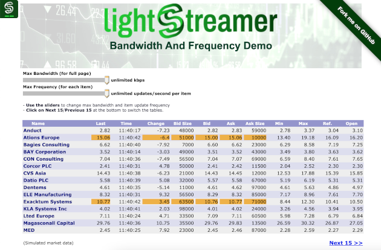

# Lightstreamer - Bandwidth and Frequency Demo - HTML Client

This project includes a special version of [Lightstreamer - Stock-List Demos - HTML Clients](https://github.com/Weswit/Lightstreamer-example-StockList-client-javascript) that demonstrates two important features of Lightstreamer: bandwidth management and frequency management.<br>

<!-- START DESCRIPTION lightstreamer-example-stocklist-client-javascript-bandwidth-and-frequency-demo---html-client -->

## Live Demo

[](http://demos.lightstreamer.com/BandwidthDemo)<br>
###[ View live demo](http://demos.lightstreamer.com/BandwidthDemo)<br>

## Details

Use the <b>Max Bandwidth</b> slider to dynamically change the maximum bandwidth granted to for the current session. The client will notify the server of the new bandwidth and the server will change the update frequency on the fly, in order to respect the bandwidth limit.
You can see that with a bandwidth as ridiculous as 0.5 kilobits per seconds, Lightstreamer is still able to deliver updates to the page, thanks to the very optimized network protocol used.<br>

Use the <b>Max Frequency</b> slider to dynamically change the maximum update rate of <b>each item</b> in the Subscription. The client will notify the server of the new frequency limit and the server will change the update frequency on the fly, in order to respect the frequency limit.<br>

You can see how the bandwidth and frequency constraints act on different levels. The bandwidth constraint is applied to the whole session, that is, to the global update flow for this page. On the other hand, the frequency constraint is applied to each row (Item) individually. Both the constraints set an upper bound, which is dynamically managed by Lightstreamer Server.
Note that thanks to MERGE mode, the updates are not queued and delayed, but resampled and conflated. In other words, when an item has a chance to be updated (based on a round-robin algorithm), it will receive the very latest state available, not an old one.<br>

Click on the link under the table (Next/Previous 15) to dynamically switch between two lists of fifteen items and see how the initial snapshot is loaded still respecting the bandwidth limit.

The demo includes the following client-side functionalities:
* Two [Subscriptions](http://www.lightstreamer.com/docs/client_javascript_uni_api/Subscription.html) containing 15 items each, subscribed to in <b>MERGE</b> mode feeding a [DynaGrid](http://www.lightstreamer.com/docs/client_javascript_uni_api/DynaGrid.html) alternately according to the selected list.

<!-- END DESCRIPTION lightstreamer-example-stocklist-client-javascript-bandwidth-and-frequency-demo---html-client -->

## Install

If you want to install a version of this demo pointing to your local Lightstreamer Server, follow these steps:

* Note that, as prerequisite, the [Lightstreamer - Stock- List Demo - Java Adapter](https://github.com/Weswit/Lightstreamer-example-Stocklist-adapter-java) has to be deployed on your local Lightstreamer Server instance. Please check out that project and follow the installation instructions provided with it.
* Launch Lightstreamer Server.
* Get the `lightstreamer.js` file from the [Lightstreamer 5 Colosseo distribution](http://www.lightstreamer.com/download) and put it in the `src/js` folder of the demo (if that is the case, please create it). Alternatively you can build a `lightstreamer.js` file from the 
  [online generator](http://www.lightstreamer.com/distros/Lightstreamer_Allegro-Presto-Vivace_5_1_1_Colosseo_20140310/Lightstreamer/DOCS-SDKs/sdk_client_javascript/tools/generator.html).
  In that case be sure to include the LightstreamerClient, Subscription, DynaGrid, and StatusWidget modules and to use the "Use AMD" version.
* Get the `require.js` file form [requirejs.org](http://requirejs.org/docs/download.html) and put it in the `src/js` folder of the demo.
* Get the zip file from [script.aculo.us](http://script.aculo.us/downloads) and put the `prototype.js`, `scriptaculous.js`, and `slider.js` files in the `src/js/scriptaculous` folder of the demo.

You can deploy this demo in order to use the Lightstreamer server as Web server or in any external Web Server you are running. 
If you choose the former case please create the folders `<LS_HOME>/pages/demos/BandwidthDemo` then copy here the contents of the `src` folder of this project.<br>
The client demo configuration assumes that Lightstreamer Server, Lightstreamer Adapters and this client are launched on the same machine. If you need to targeting a different Lightstreamer server please search this line:
```js
var lsClient = new LightstreamerClient(protocolToUse+"//localhost:"+portToUse,"DEMO");
```
in `lsClient.js` and change it accordingly.<br>

The demo is now ready to be launched.

## Build

The html application can be optionally built, to reduce the number and size of the files to be downloaded by the browser, using [r.js](http://requirejs.org/docs/optimization.html). A ready-made configuration file for the build process of the demo is available in the `build_rjs` folder of this project.

The build is configured to use [Google Closure compiler](https://code.google.com/p/closure-compiler/) to minify the files. To run it as is you need to download [rhino](https://developer.mozilla.org/en-US/docs/Rhino) `js.jar` file, `compiler.jar` from the closure compiler project and `r.js` from RequireJS. You also need a [Java Virtual Machine](https://www.java.com/en/download/) installed on your system.

Once ready, from the `build_rjs` folder, run

```cmd
java -cp compiler.jar;js.jar org.mozilla.javascript.tools.shell.Main r.js -o app.build.js
```

As an alternative it is possible to customize the build file to use [UglifyJS](https://github.com/mishoo/UglifyJS2); in this case it can be built using [node.js](http://nodejs.org/) instead of using the JVM.

## See Also

### Lightstreamer Adapters Needed by These Demo Clients
<!-- START RELATED_ENTRIES -->

* [Lightstreamer - Stock-List Demo - Java Adapter](https://github.com/Weswit/Lightstreamer-example-Stocklist-adapter-java)
* [Lightstreamer - Reusable Metadata Adapters - Java Adapter](https://github.com/Weswit/Lightstreamer-example-ReusableMetadata-adapter-java)

<!-- END RELATED_ENTRIES -->

### Related Projects

* [Lightstreamer - Stock-List Demos - HTML Clients](https://github.com/Weswit/Lightstreamer-example-StockList-client-javascript)
* [Lightstreamer - Basic Stock-List Demo - jQuery (jqGrid) Client](https://github.com/Weswit/Lightstreamer-example-StockList-client-jquery)
* [Lightstreamer - Stock-List Demo - Dojo Toolkit Client](https://github.com/Weswit/Lightstreamer-example-StockList-client-dojo)
* [Lightstreamer - Stock-List Demos - Flex Clients](https://github.com/Weswit/Lightstreamer-example-StockList-client-flex)
* [Lightstreamer - Basic Stock-List Demo - Java SE (Swing) Client](https://github.com/Weswit/Lightstreamer-example-StockList-client-java)
* [Lightstreamer - Basic Stock-List Demo - .NET Client](https://github.com/Weswit/Lightstreamer-example-StockList-client-dotnet)

## Lightstreamer Compatibility Notes

* Compatible with Lightstreamer JavaScript Client library version 6.0 or newer.
